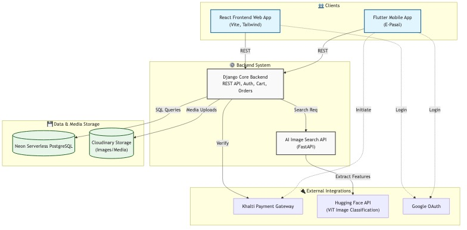

# E-Pasal (Major Project) - System Architecture

## Overview
E-Pasal is a modern, modular e-commerce application bridging cutting-edge AI image classification with traditional online shopping workflows. The platform is designed to offer a seamless experience across multiple clients while maintaining a scalable backend system that delegates complex machine learning tasks to a dedicated microservice.

## 1. Client Layer
The system provides two primary user-facing applications:

- **React Web Application (`mp_frontend`)**
  - **Framework:** React.js powered by Vite.
  - **Styling:** Tailwind CSS for a responsive, utility-first design.
  - **Role:** Serves as the primary web portal for users to browse catalogs, view their carts, and execute payments.

- **Flutter Mobile Application (`E-Pasal`)**
  - **Framework:** Flutter (Dart).
  - **Role:** Provides a native app experience for iOS and Android. Incorporates deep integrations with mobile payment SDKs (Khalti) and secure local credential storage.

## 2. API & Backend Services Layer
The backend logic is decoupled into a core monolith and a specialized microservice.

### Django Core Backend (`majorproject`)
Serves as the central source of truth and REST API provider for the e-commerce system.
- **Framework:** Django with Django REST Framework (DRF).
- **Key Modules:**
  - `authentication`: Manages user credentials, JWTs (`djangorestframework_simplejwt`), and Google OAuth via `dj-rest-auth` & `django-allauth`.
  - `products` & `categories`: Catalog management, inventory, and categorization.
  - `cart`, `orders`, `wishlist`: Core e-commerce shopping workflows.
  - `payment`: Backend verification handlers for Khalti transactions.
  - `image_search`: Intermediate application proxying requests to the AI engine.

### AI Search Microservice (`simple_api.py`)
A fast, lightweight API designed specifically to handle image inference.
- **Framework:** FastAPI running on Uvicorn.
- **Role:** Handles incoming image uploads, forwards them to the Hugging Face Inference API, and parses the returned feature vectors/predictions to find similar products in the database. 
- **Model:** Interacts with the `nigamyadav72/vit-ecommerce-classifier` Vision Transformer.

## 3. Data & Storage Layer
The application uses modern cloud storage and serverless databases to decouple state from the application servers.

- **Primary Database: Neon Serverless PostgreSQL**
  - A cloud-native Postgres database utilized by Django via `dj-database-url` and `psycopg2`.
  - Stores all relational data including User accounts, Products, Orders, and AI embedding references.

- **Media Storage: Cloudinary**
  - **Role:** Acts as the CDN and storage bucket for all media assets.
  - **Integration:** Handled seamlessly through `dj3-cloudinary-storage` so that image uploads in the Django Admin or OpenAPI automatically sync to the cloud.

## 4. External Integrations
- **Hugging Face Inference API**: Powers the visual search capability by classifying uploaded images against the custom ViT model without requiring heavy local GPU resources.
- **Khalti Payment Gateway**: Provides localized digital wallet transactions. The system initiates payments on the client (Flutter SDK/Web) and verifies the payload status securely on the Django backend against Khalti's servers.
- **Google OAuth**: Facilitates one-click social logins across both mobile and web clients.

## High-Level Request Flow (Example: Image Search)
1. **Client** uploads a picture of a product via the Flutter App or React Web App.
2. The image goes to the **Django `image_search` App** API.
3. Django proxies the raw image file securely to the **FastAPI Microservice**.
4. FastAPI validates the file and calls the **Hugging Face ViT model**.
5. Hugging Face returns a classification/vector score.
6. FastAPI matches this score against product labels/thresholds and returns SKU suggestions.
7. Django queries the **Neon PostgreSQL** database for the complete product details of those SKUs.
8. The client receives populated products displaying images served from **Cloudinary**.
